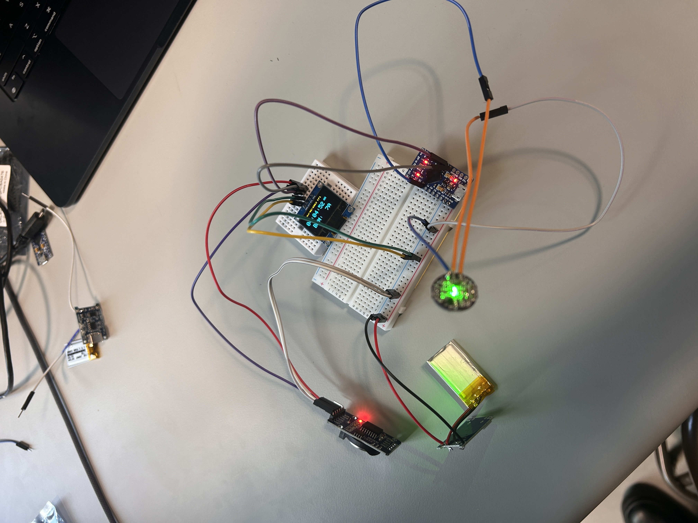
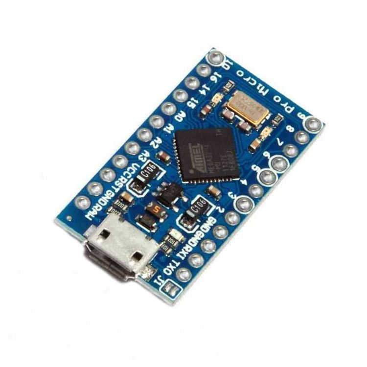
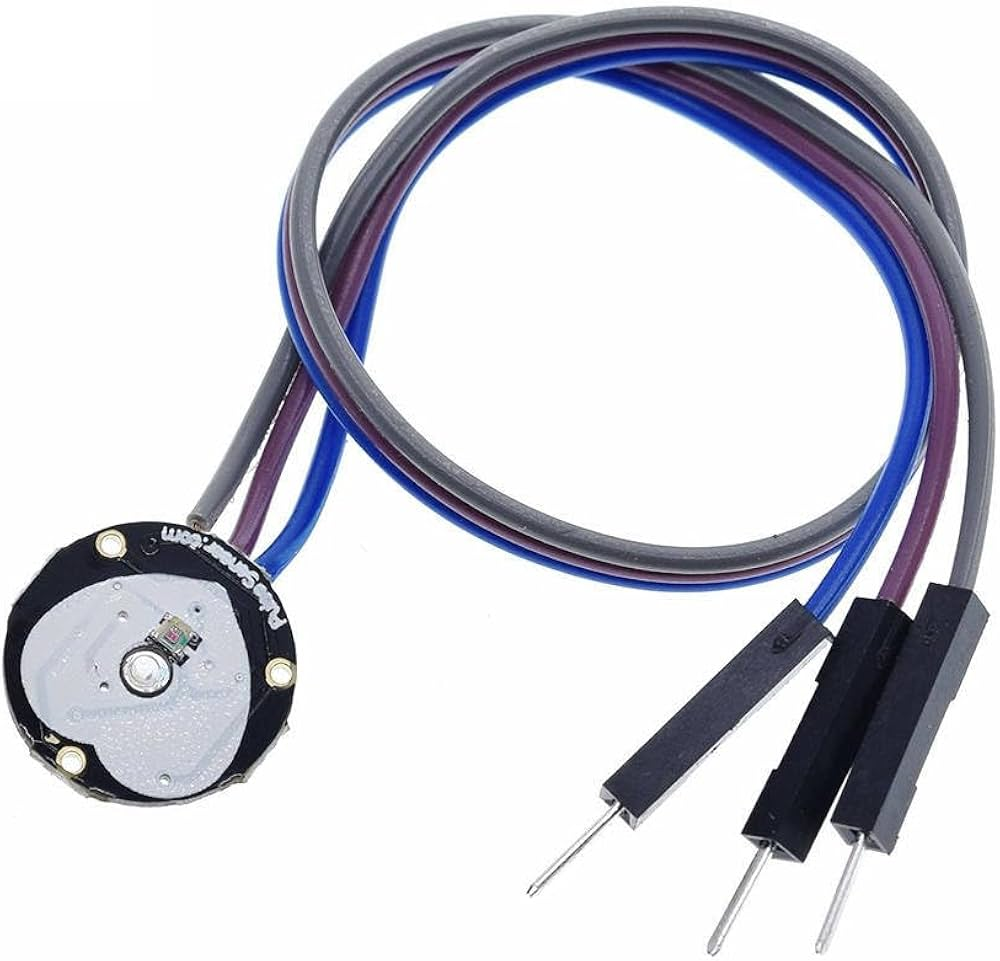
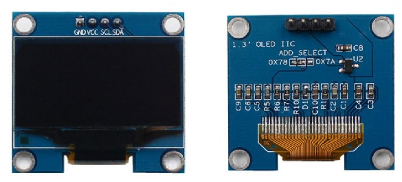
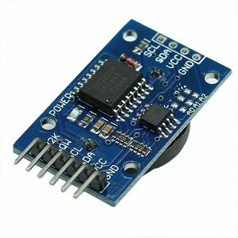
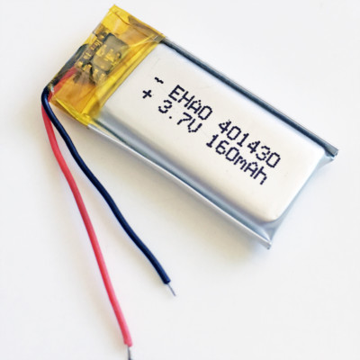
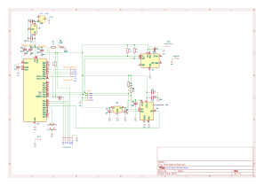

# Heartrate Monitor Smartwatch - Electronics Club
Led the development of a heartrate monitor smartwatch based on the ATmega328P microcontroller with a group of 4. Utilized several sensors to send/recieve data via I2C communication protocol using C based Arduino IDE. Designed custom PCB while analyzing several datasheets to reduce device size and create a more ergonomic user experience. 

This project was seperated into two teams. The Team 1 specialized in hardware development and was responsible for component selection, power distribution, datasheet analysis and PCB design. Team 2 interfaced with the microcontroller and sensors in the Arduino IDE by utilizing libraries like PulseSensor Playground, Adafruit_SSD1306, and RTClib. While I primarily led Team 1, I also served as the mediator for cross-team communication to ensure hardware and software supported each other.

## Smartwatch Project Objectives

| Feature | Description | Goal |
| :--- | :--- | :--- |
| **Heart Rate Monitor** | Integrate Pulse Sensor | Provides accurate heartrate measurments. |
| **OLED Display** | OLED Display | Clear visual output for biometric data and time. |
| **Timekeeping** | RTC (Real-Time Clock) | Maintain precise time and date. |
| **Power System** | Rechargeable LiPo | Provides rechargeable power. |

Throughout every iteration of this project we may have moved forward with different components that better fit our needs, however, the 4 underlying features above were included in every version of this project. 

## Proof of Concept

The image above shows the first prototype of our Smartwatch. This version was based off of Arduino's smallest dev board the Pro Mini which houses the ATmega328P as its microcontroller (we would later use on the final versions of our project). To provide the functionalities we desired, we ordered several Arduino compatible modules that we could power and hook up to specific digital pins on the Pro Micro. In the table below is the comprehensive parts list we used for our first prototype:

| Feature | Part Name | Image |
| :--- | :--- | :--- |
| **Microcontroller** | Arduino Pro Micro |  |
| **Heart Rate Monitor** | Integrate Pulse Sensor | |
| **OLED Display** | OLED Display |  |
| **Timekeeping** | RTC (Real-Time Clock) | |
| **Power System** | Rechargeable LiPo | |

### Pulse Sensors Issues
The OLED display shows time, date, and current heartrate reading. Team 2 was able to program the Pro Micro to read from the RTC module and pulse sensor then display the results on the OLED. The pulse sensor results fluctuated quite a bit. After some research, we attributed this to the quality of the sensor itself. Many cheap pulse sensors use a method called photoplethysmography (PPG) to measure the change in blood volume in your capillaries as your heart beats. The pulse sensor module uses a green LED to shine light into the capillaries and measures the amount of light reflected back using a photodetector. Ideally, the pulse sensor can translate this information into an accurate heart rate reading. PPG is cheap, however, its very sensitive to real world motion, ambient light interference and sensor contact. 
[*references*](https://www.sciencedirect.com/topics/engineering/sensor-pulse#:~:text=A%20pulse%20sensor%20is%20defined,Arduino%20for%20health%20monitoring%20applications.)

More accurate pulse sensors (professional grade) cost hundreds or thousands of dollars. Luckily, there is a cheaper PPG option, the MAX30102, that uses multi-wavelngth LEDs and has an on board processing IC. It also includes Sp02 readings as an added feature. We later decided to switch to the MAX30102 pulse oximeter to replace the pulse sensor module.

### First Prototype
To turn our bread board prototype into something that resembeled a watch, we soldered the modules together trying to keep wires as short as possible. The following video shows the result:

<video src="https://github.com/user-attachments/assets/febb02ad-0546-478b-9966-6aa6d14cd212" width="400" controls></video>

During this stage of the design process, my team and I realized that size was going to be our our main constraint. The form factor shown above is ridiculously large to be comfortably worn on the wrist. After the 3D printed housing, my team and I estimated our first prototype's dimensions would be around 45mm x 45mm x 50mm, which would better be used as a desk clock. After doing more research and conversing amongst ourselves and with our peers, we decided to create a custom PCB that would eliminate many of the unecessary functions our sensor modules included. For example, the Pro Micro included headers for every I/O pin, only ~5 of which were essential and the DS3231 RTC module included alarm and 32kHz square wave output functionalities that were out of the scope of this project. By creating a custom PCB, we could limit unecessary functions of our modules, reducing size and creating a more ergonomic design.

## PCB design

Although we decided to transition to the MAX30102 pulse oximeter, our proof of concept was still valid as we are only replacing the pulse sensor and there are countless resources online showing the MAX30102's compatibility with the 328P. With this, we decided to move forward into PCB design for our second prototype.

To minimize the size of our PCB, we only wanted to include functionalities that were (for the most part) strictly necessary for our smartwatch. We would essentially be stripping the modules from our prototype and putting everything on one PCB. First, we researched the bare minimum requirements for the ATmega328P microcontroller. Using the microcontroller's datasheet and online resources, we were able to dumb the circuit down to a few capacitors and a pull-up resistor. There was an optional 16MHz external crystal oscillator that was typically used with the 328P, however, these clock speeds wouldn't be necessary for our use case. We could instead use the 8MHz internal oscillator. We used similar techniques to reduce the size of our RTC and sensor modules. 

|  |
| :---: |
| *Figure 2: System Schematic for the Smartwatch Heart Monitor* |

To use the 328P's 8MHz internal clock, we were required to run the microcontroller at 3.3V, however, our LiPo was 4.2V-3.7V. To fix this, we simply included a 3.3V Low Dropout regulator (LDO) after the ON switch. 

